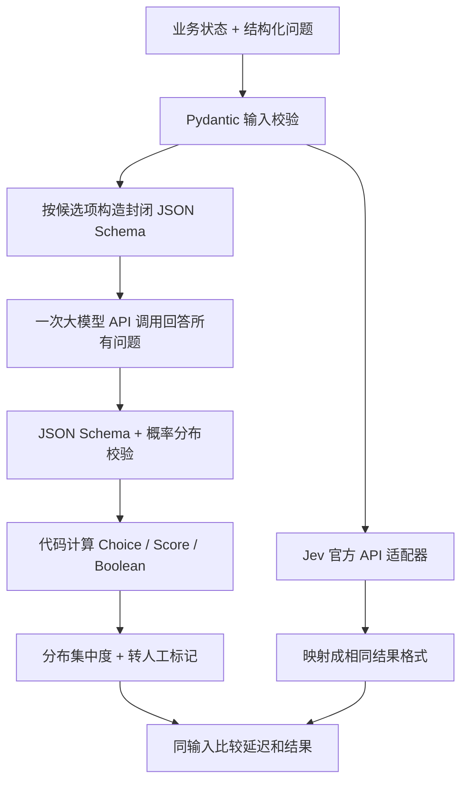

# Wald Agent

用 Python 和大模型 API 实现结构化决策：业务状态 + 多个问题 → Choice / Score / Boolean + 概率分布 + 转人工标记。

完整的单实例决策服务：包含同步/异步 Python SDK、HTTP API、批处理、数据库持久化、幂等请求、人工复核、Jev 对比评测、图像判断、监控、备份和 Docker 部署。大模型通过 OpenAI 兼容的 Chat Completions API 调用，无需本地 GPU。它使用生成式 API，没有实现 Jev 的私有架构或 RLCD，概率质量和实际延迟须用业务数据验证。

支持 Python 3.11+。部署范围是**一个服务进程 + 本地 SQLite 持久卷**；进程锁会阻止多个 worker 共用数据库。操作步骤、错误处理、容量配置和恢复方式见 [运维说明](docs/operations.md)。

## 1. 项目设计



| 模块 | 职责 |
| --- | --- |
| `src/wald_agent/schemas.py` | 三类问题和结果；禁止未知字段、非法类型、非有限数字 |
| `src/wald_agent/engine.py`、`llm.py` | 批量判断、动态 JSON Schema、拒答/截断/格式错误处理 |
| `src/wald_agent/probability.py` | 校验概率、计算期望分数和分布集中度 |
| `src/wald_agent/jev.py` | 直接调用官方 `/v1/systemone`，适配 Noul 和 Score |
| `src/wald_agent/api.py`、`sdk.py` | FastAPI HTTP 服务、同步/异步 Python SDK |
| `src/wald_agent/runtime.py`、`storage.py` | 并发队列、客户端限流、SQLite 审计、幂等与人工复核 |
| `src/wald_agent/transport.py`、`resilience.py` | 连接池、总超时、有限重试、熔断与半开恢复 |
| `src/wald_agent/middleware.py`、`observability.py` | Bearer 鉴权、请求大小限制、请求 ID、JSON 日志、Prometheus |
| `src/wald_agent/admin.py` | 初始化、启动、配置/连通性检查、在线备份、复核数据导出 |
| `scripts/compare_jev.py` | 同输入、多次调用的耗时和判断差异测试 |
| `scripts/jev_image.py` | 视觉大模型提取事实，再直接调用 Jev 判断 |
| `tests/` | 协议/故障/并发测试，以及本地 TCP、真实子进程的验收测试 |

多个问题放在一次 LLM 请求中，减少网络往返；这里不承诺 LLM 内部并行解码。服务使用异步 HTTP 客户端并复用连接。

## 2. 安装和配置

Python 3.11+，以下命令在项目根目录执行：

```bash
uv sync --locked --extra dev
uv run wald init
```

也可使用普通 venv：

```bash
python3 -m venv .venv
source .venv/bin/activate
pip install -e '.[dev]'
```

配置集中在 [config/](config/README.md)：`.env.example` 是可提交的空密钥模板，`.env` 保存本地真实密钥并被 Git 忽略。`wald init` 根据模板创建 `config/.env`（权限 0600）、生成服务访问密钥并准备示例输入；存在的配置不会被覆盖。安装 wheel 后，也可在任意工作目录运行 `wald init`，同时得到模板和本地配置。编辑 `config/.env`，填入上游密钥：

```dotenv
LLM_BASE_URL=https://api.openai.com/v1
LLM_API_KEY=your-llm-key
LLM_MODEL=gpt-4o-mini
TYPESAFE_API_KEY=your-typesafe-key
JEV_MODEL=jev-1.13.0
VISION_MODEL=gpt-4o-mini
ENABLED_PROVIDERS=["llm","jev"]
```

- 只用 Wald 文本决策时，只需大模型密钥，保留 `ENABLED_PROVIDERS=["llm"]`。`OPENAI_API_KEY` 也可作为 `LLM_API_KEY` 的回退。
- 对比测试需要两家密钥。Jev 密钥来自 [TypeSafe 官方控制台](https://console.typesafe.ai)，账号须有模型访问权限。
- 图像模式需要支持视觉输入的模型。默认共用大模型连接；使用其他服务商时，配置 `VISION_BASE_URL`、`VISION_API_KEY`、`VISION_MODEL`。
- 地址须包含服务商的 API 前缀，例如 `/v1`；代码再拼接 `/chat/completions` 或 `/systemone`。
- 默认 `LLM_RESPONSE_FORMAT=json_schema`。不支持 Structured Outputs 的兼容服务可改成 `json_object`；本地严格校验仍会执行。
- 默认发送 `max_completion_tokens`。需要旧字段的服务可配置 `LLM_TOKEN_LIMIT_FIELD=max_tokens`。默认不发送 temperature；支持的模型可设置 `LLM_TEMPERATURE=0`，这不保证确定性。
- **所有实际密钥统一放在 `config/.env`**，包括大模型、Jev、视觉模型和服务访问密钥。`config/` 目录可以提交；其中 `.env`、`.env.local`、`.env.backup` 等真实配置被 Git 忽略，也排除在 Docker 构建和发布包之外。`data/` 和 `reports/` 仍被忽略。
- 仓库中的 `config/.env.example` 和 `config/README.md` 可以公开提交，请不要在其中填写真实密钥。命令读取当前工作目录下的 `config/.env`；环境变量优先，不会在日志中输出密钥或请求正文。
- 旧版本使用的根目录 `.env` 请迁移至 `config/.env`；程序不再自动读取根目录 `.env`，原有 Git 忽略规则仍保留。

本地 `uv sync --locked` 和 Docker 都按 `uv.lock` 安装。普通 pip 按版本范围解析；发布部署推荐锁定安装方式。下文使用 `uv run`，使用已激活 venv 时去掉该前缀。

检查配置与账号连通性：

```bash
uv run wald doctor
uv run wald doctor --live --output reports/doctor.json
```

不加 `--live` 不调用模型；加上后，每个已启用的服务商会收到一条小型付费请求（可按重试策略重试）。没有密钥时检查会明确失败，不会返回伪造决策。

## 3. 直接调用和 HTTP API

无需启动服务器即可调用本项目，或直接调用 Jev：

```bash
uv run python scripts/decide.py --input examples/customer_service.json
uv run python scripts/decide.py --provider jev --input examples/customer_service.json
```

启动 HTTP 服务：

```bash
uv run wald serve --host 127.0.0.1 --port 8000
```

```bash
curl http://127.0.0.1:8000/v1/decide \
  -H 'Authorization: Bearer <config/.env 中生成的 WALD_API_KEY>' \
  -H 'Content-Type: application/json' \
  -H 'Idempotency-Key: ticket-2026-001' \
  --data-binary @examples/customer_service.json
```

默认配置为生产模式，必须鉴权；服务密钥至少 32 个字符。`/healthz` 检查存活，`/readyz` 检查凭据配置和数据库。开发模式 `WALD_ENV=development` 提供 `/docs` 和 `/openapi.json`，这两个地址也受服务密钥保护；生产模式关闭交互文档。完整接口列表见下表。

| 方法和地址 | 用途 |
| --- | --- |
| `POST /v1/decide?provider=llm` | 一份业务状态，多问题决策；`provider=jev` 使用 Jev |
| `POST /v1/decide/batch?provider=llm` | 1–32 份请求，受控并发；每项分别返回结果或错误 |
| `POST /v1/images/decide` | 视觉 API 提取事实后调用 Jev，或直接输入事实 |
| `GET /v1/decisions/{decision_id}` | 查询原请求、模型结果、失败信息与复核结论 |
| `GET /v1/reviews?resolved=false&limit=25` | 分页列出待复核项，使用返回的 `next_cursor` 作为 `after` |
| `POST /v1/reviews/{decision_id}` | 提交完整人工标签，校验类别与版本，防止覆盖 |
| `GET /metrics` | Prometheus 请求数、耗时、上游尝试数、转人工数量 |

服务端成功结果附带 `decision_id`、`request_id`、模型版本、调用次数和上游请求 ID。相同客户端使用同一 `Idempotency-Key`、相同请求与模型配置时，复用已持久化的结果；正文改变或相同键仍在执行会返回 409。失败也会保存并重放，详见运维说明。

Python SDK：

```python
import asyncio
from pathlib import Path
from wald_agent import DecisionRequest, WaldClient
from wald_agent.config import Settings

async def main():
    request = DecisionRequest.model_validate_json(
        Path("examples/customer_service.json").read_text(encoding="utf-8")
    )
    key = Settings().wald_api_key.get_secret_value()
    async with WaldClient("http://127.0.0.1:8000", api_key=key) as client:
        result = await client.decide(request, idempotency_key="ticket-2026-001")
        print(result.answers["department"].choice)
        print(result.answers["urgency"].score)
        print(result.needs_review)

asyncio.run(main())
```

同步 SDK 将上面替换成 `with SyncWaldClient(url, api_key=key) as client:` 和 `client.decide(request)` 即可。一个同步客户端只在创建它的线程中使用，异步代码使用 `WaldClient`。两者都支持 `decide_batch`、`decide_image`、`get_decision`、`list_reviews`、`resolve_review`，必须用上下文管理器或显式关闭以释放连接。

SDK 的服务端错误为 `RemoteServiceError`，包含 `status_code`、`code`、`retry_after`、`request_id`、可用时的 `decision_id`。SDK 默认不重试 HTTP 服务请求。也可直接使用 `DecisionEngine` 或 `JevClient`；直接调用有上游超时/重试/校验，但没有 HTTP 服务的鉴权、持久化、限流或复核队列。

批量与人工复核示例：

```python
from wald_agent.schemas import BatchDecisionRequest, BatchItem, ReviewResolution

# 在上面的 async with client 内调用。
batch = await client.decide_batch(BatchDecisionRequest(items=[
    BatchItem(id="ticket-1", request=request),
    BatchItem(id="ticket-2", request=request),
]), idempotency_key="batch-2026-001")
for item in batch.results:
    print(item.id, item.result or item.error)

page = await client.list_reviews(limit=25)
# 人员检查原始证据后提交；标签必须对应该记录原本的问题。
if page.items:
    record = page.items[0]
    reviewed = await client.resolve_review(record.id, ReviewResolution(
        answers={"department": "billing", "refund_requested": True, "urgency": 1},
        reviewer="operator-001", notes="已核对账单", expected_revision=record.revision,
    ))
```

该服务保存人工结论，不会代业务系统退款、转账或创建外部工单。复核标签可导出成原生评测数据：

```bash
uv run wald export-feedback --output reports/reviewed.jsonl
uv run wald-compare --dataset reports/reviewed.jsonl --runs 5 --output reports/reviewed-eval.json
```

### 输入输出约定

完整请求见 `examples/customer_service.json`，可直接替换中文或英文业务内容。

| 问题 | 请求 | 结果 |
| --- | --- | --- |
| Choice | `type: choice`，`criteria` 为候选名到描述的字典，2–255 项 | `choice` 为最大概率项；平局时 Wald 选请求中的首项，Jev 保留其有效选择 |
| Boolean | `type: boolean` 或 `noul`；可选 `true`/`false` 描述 | `probability_true`；`boolean = probability_true >= 0.5` |
| Score | `type: score`，`criteria` 为从低到高的 2–10 级描述 | `score = Σ(level × probability)`，可为小数 |

Score 默认从 0 开始；设置 `min_value: 1` 和五个等级描述即可得到 1–5 分。Jev 原生从 0 开始，适配器会对等级键和期望分数统一平移，避免把 0–4 和 1–5 直接比较。Jev 原始分数经同样平移保存在 `provider_score`；标准化 `score` 始终由概率重新计算。

每个答案含 `probabilities`、`confidence`、`needs_review`。请求级 `needs_review` 是所有问题的 OR。低于请求中的 `review_threshold`（默认 0.5）时标记转人工；通过 HTTP 服务执行的这类结果会进入持久化待复核队列。

### 概率与置信度

LLM 只输出各候选项的概率，标签、评分和布尔值由代码计算，因此不会出现标签与概率最大项矛盾的成功结果。

```text
confidence = 1 - H(p) / log(K)
H(p) = -Σ p × log(p)
needs_review = confidence < review_threshold
```

`confidence` 表示分布集中度，**不是正确率**。LLM 概率是自报估计，标记为 `probability_source: llm_self_report`，没有做统计校准。两家结果均标记 `calibration_status: not_validated_on_your_data`，不能根据单个回答证明校准效果。

比较时两边采用同一公式。Jev 的原有 Choice/Score 置信度保留在 `provider_confidence`；Noul 原生没有该字段，返回 null。不要将 Jev 原始置信度与这里的集中度直接相减。

概率必须有限、处于 0–1，并包含全部且仅包含合法候选项。概率和与 1 的误差只能在 0.001 以内，小误差归一化只用于消除舍入，不是校准。格式/概率错误、拒答或截断均作为失败返回，没有用均匀分布伪造成功结果。

## 4. 与 Jev 对比

单输入测试：

```bash
uv run python scripts/compare_jev.py \
  --input examples/customer_service.json \
  --runs 5 --warmup 1 \
  --output reports/comparison.json
```

两家各执行 1 次预热 + 5 次测量，共 12 次真实 API 调用。每次使用相同的 `state`、问题指令和候选描述；只转换供应商必需的协议字段。控制台打印延迟表和逐题判断，完整报告包含：

- 每次请求的输入、标准化输出、实际模型版本、token 用量、耗时和错误。
- 成功请求的平均延迟、P50/P95、失败率、转人工比例。
- 选择/布尔是否一致、评分绝对差、候选概率差、总变差距离 `TV = 0.5 × Σ|p - q|`。
- 配对成功请求的 `P50(Wald) / P50(Jev)`；大于 1 表示该测试中 Wald 较慢。
- 同一输入重复调用的众数标签一致率；Score 使用最高概率等级作为标签。

评分差在 `--score-tolerance 0.25` 范围内视为一致，可按业务修改。没有人工标签时，只报告一致性，不声称谁更准确。

带标签测试：

```bash
uv run python scripts/compare_jev.py \
  --dataset examples/customer_service_cases.jsonl \
  --runs 5 --warmup 1 \
  --output reports/labeled-comparison.json
```

示例有六条中英文客服数据，人工示例标签用于演示指标，不是代表性评测集。JSONL 每行包含 `id`、完整的 `request`，以及可选 `expected`：

```json
{"department":"billing","refund_requested":true,"urgency":3}
```

以上是 `expected` 的示例值。可只标注部分题目；Choice 用候选 key，Boolean 用 JSON boolean，Score 用请求评分范围内的整数等级。相同问题 ID 须对应同一套定义。

`summary.<provider>.metrics_by_question` 包含 Accuracy、Macro-F1、Brier、10 分箱 ECE、Score MAE。Macro-F1 对真值/预测出现的类别取宏平均；Brier 为多分类平方误差和，范围 0–2；ECE 使用预测类别的概率，不使用熵集中度。重复观测会全部计入且彼此相关；评估校准和泛化需要独立、足量的人工标注数据。

连同本项目 HTTP 服务开销测量：

```bash
uv run python scripts/compare_jev.py \
  --input examples/customer_service.json \
  --wald-url http://127.0.0.1:8000 --runs 10
```

默认比较“本进程 Wald 引擎 → LLM API”与“本进程 Jev 客户端 → Jev API”。`--wald-url` 额外包含访问 Wald 的网络、排队和持久化开销。测试使用单并发、随机配对顺序、固定种子和复用连接，预热不计入统计。直接对比默认 `--retries 0`，覆盖日常服务重试配置；可显式修改。HTTP 模式不能替远端修改策略，需自行将服务的 `API_MAX_RETRIES=0` 后重启，报告将重试策略标记为未知。失败仍写入报告并使脚本以 1 退出，配置错误以 2 退出。

延迟包含网络、完整响应和验证，不是纯模型推理时间。报告吞吐是成功数除以该服务所有尝试的累计耗时，只代表串行测试，不是并发容量。供应商缓存、地域、限流和负载仍会影响结果，少量重复的 P95 仅供观察。报告保存了业务输入，请保存在合适的位置。

## 5. 图像识别后直接调用 Jev 判断

**Jev 目前仅支持文本输入，不能将图片 URL/Base64 直接交给它识别。** `scripts/jev_image.py` 使用：

```text
本地图片 / 图片 HTTPS URL
    → 视觉大模型 API：对象、可见文字、图像质量和不确定项
    → Jev 官方 API：根据文本事实回答结构化问题
```

默认判断“主体是猫、狗、其他还是无法判断”，以及“是否包含猫”：

```bash
uv run python scripts/jev_image.py \
  --image /absolute/path/to/cat.jpg \
  --facts-output reports/cat-facts.json
```

```bash
uv run python scripts/jev_image.py \
  --image-url 'https://your-domain.example/cat.jpg' \
  --questions examples/image_questions.json
```

请替换成真实图片路径/地址。本地支持单帧 PNG/JPEG/WebP，限制 10 MiB、2500 万像素，并校验实际格式；HTTP API 也校验 base64 内容和 MIME。远程 HTTPS URL 由视觉服务商获取。编辑 `examples/image_questions.json` 可定义其他判断。视觉事实使用英文描述，配合 Jev 当前主要训练语言；这不能消除识别错误。

有现成 OCR/图片事实时，只调用 Jev：

```bash
uv run python scripts/jev_image.py --description-file examples/visual_facts.json
```

`visual_facts.json` 是人工编写的演示事实，不是对真实图片执行的识别结果。可把上一次 `--facts-output` 文件作为输入。输出保留事实和不确定项，分别报告 `timing_ms.vision`、`timing_ms.jev`、`timing_ms.pipeline_total`；总计时不包含命令行启动或本地读图编码。

结果标记 `native_jev_vision: false`。Jev 置信度只针对文本事实，不能代表视觉管线准确率。存在视觉不确定项、图像不清晰或 Jev 判断集中度不足时，顶层 `needs_review` 为 true，并返回 `review_reasons`。

通过 HTTP 服务执行、存储和复核图像结果：

```python
from pathlib import Path
from wald_agent.vision import ImageDecisionRequest, local_image_url

# 在上面的 async with client 内调用；服务需启用 jev。
image_result = await client.decide_image(ImageDecisionRequest(
    image_url=local_image_url(Path("/absolute/path/to/cat.jpg")),
), idempotency_key="photo-2026-001")
```

数据库保存视觉事实和结果；不保存原始图片 URL/base64，只保存该输入的 SHA-256。需要重跑图像时，应自行保存原图。

## 6. 测试与部署

```bash
uv run pytest -q
uv run ruff check src scripts tests
uv run ruff format --check src scripts tests
uv run pytest -m process -q
uv build --wheel
docker compose up --build -d
```

自动化测试不调用外部付费 API，覆盖协议映射、Schema/概率校验、SDK、租户隔离、重试/熔断、超时/取消、幂等竞争与重启恢复、批量部分失败、复核冲突、备份和评测指标。`process` 测试启动本地模拟供应商及真正的服务进程，检查 TCP 调用、重启持久性、同步 SDK 与 CLI 数据导出；禁止本地端口的沙箱会跳过这一项，普通环境和 CI 会执行。

CI 配置在 `.github/workflows/ci.yml`，覆盖 Python 3.11/3.13、静态检查、测试、wheel 独立安装与 Docker 启动检查。Docker 使用非 root 用户、只读根文件系统和 `wald-data` 持久卷，端口默认只绑定本机。部署前执行 `wald doctor --live` 检查真实模型权限；`/readyz` 不产生付费探测。

备份与日常维护：

```bash
uv run wald backup --output reports/wald-backup.sqlite3
docker compose logs -f --tail 100 wald
```

本地命令备份 `config/.env` 配置的数据库。容器数据库应在容器中执行 `wald backup --output /app/data/backup.sqlite3`，再复制备份文件。备份使用 SQLite 在线备份 API，包括 WAL 中已提交的数据，拒绝覆盖已有文件。详细恢复、密钥轮换、监控指标和资源配置见 [运维说明](docs/operations.md)。

## 7. 官方资料与后续方向

接口按 2026-09-22 检查的官方资料实现：

- [TypeSafe API](https://docs.typesafe.ai/api)：调用协议和三类原语。
- [TypeSafe Score](https://docs.typesafe.ai/primitives/score)：原生 0 起点评分、概率加权期望。
- [TypeSafe Noul](https://docs.typesafe.ai/primitives/noul)：yes 概率，没有单独置信度字段。
- [TypeSafe State](https://docs.typesafe.ai/concepts/state)、[Models](https://docs.typesafe.ai/models)：文本限制和语言支持。
- [OpenAI Structured Outputs](https://developers.openai.com/api/docs/guides/structured-outputs)：Schema 输出约束、JSON 模式。
- [OpenAI Images and vision](https://developers.openai.com/api/docs/guides/images-vision)：视觉输入格式。

后续可在独立验证集拟合校准器、按错误成本调转人工阈值，或在积累标注后替换成专用分类模型。本版按需求直接调用大模型 API，不包含本地模型训练/蒸馏流程。
